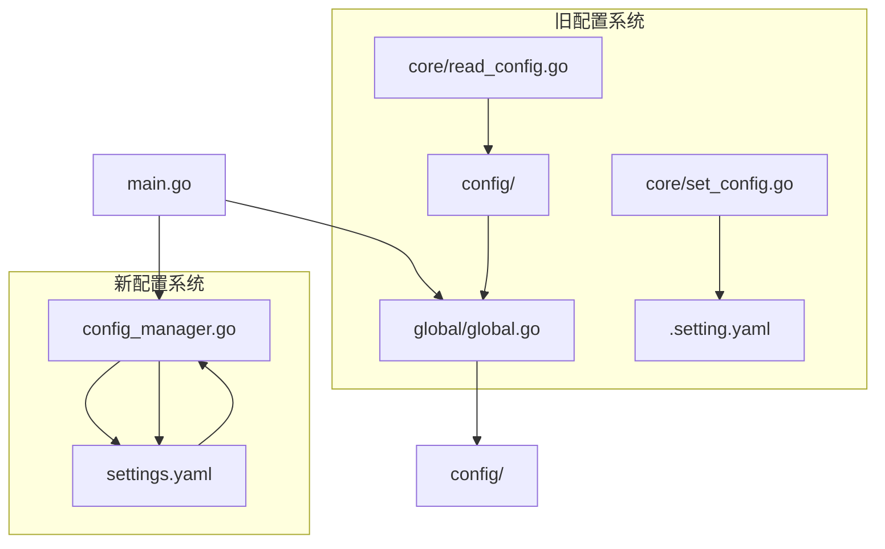

# RBAC管理员服务器配置流程关系文档

## 🎯 项目概述

这是一个基于Gin框架的RBAC管理员服务器项目，采用分层架构设计，支持配置文件的热重载和回写功能。

## 📁 项目结构

```
rbac_admin_server/
├── config/                    # 配置定义层
│   ├── enter.go              # 配置入口结构体
│   └── system.go             # 系统配置定义
├── core/                     # 配置操作核心层
│   ├── read_config.go        # 配置读取功能
│   └── set_config.go         # 配置写入功能
├── global/                   # 全局变量层
│   └── global.go             # 全局配置实例
├── config_manager.go         # 高级配置管理器（热重载+回写）
├── main.go                   # 主程序入口
├── settings.yaml             # 实际配置文件
└── 配置流程关系.md           # 本文档
```

## 🔗 配置调用关系图



## 🏗️ 配置层级架构

### 第一层：配置定义层 (config/)
- **作用**：定义所有配置结构体
- **文件**：
  - `enter.go`：配置总入口结构体
  - `system.go`：系统级配置细分

### 第二层：全局管理层 (global/)
- **作用**：提供全局配置实例访问
- **文件**：
  - `global.go`：全局Config变量定义

### 第三层：配置操作层 (core/)
- **作用**：提供配置的读写操作（旧系统）
- **文件**：
  - `read_config.go`：从settings.yaml读取配置
  - `set_config.go`：写入配置到.setting.yaml

### 第四层：高级管理层 (config_manager.go)
- **作用**：提供现代化的配置管理功能
- **特性**：
  - 配置热重载（基于fsnotify）
  - 配置回写（原子写入）
  - 线程安全访问
  - 实时文件监控

### 第五层：应用入口层 (main.go)
- **作用**：整合所有配置系统，提供演示功能

## 🔄 配置流程详解

### 初始化流程

```go
// 1. main.go 中的初始化流程
func main() {
    // 步骤1: 创建配置管理器
    configManager, err := NewConfigManager("./settings.yaml")
    
    // 步骤2: 获取当前配置
    config := configManager.GetConfig()
    
    // 步骤3: 使用配置
    fmt.Printf("端口: %d", config.Server.Port)
}
```

### 读取配置流程

#### 旧系统流程（已废弃）
```go
// core/read_config.go
func ReadConfig() *config.Config {
    // 1. 读取settings.yaml文件
    byteData, _ := os.ReadFile("./settings.yaml")
    
    // 2. 解析YAML到结构体
    var c *config.Config
    yaml.Unmarshal(byteData, &c)
    
    // 3. 返回配置实例
    return c
}
```

#### 新系统流程（推荐）
```go
// config_manager.go
func (cm *ConfigManager) load() error {
    // 1. 读取文件
    data, _ := os.ReadFile(cm.filename)
    
    // 2. 解析YAML
    var newConfig Config
    yaml.Unmarshal(data, &newConfig)
    
    // 3. 线程安全更新
    cm.mu.Lock()
    cm.config = &newConfig
    cm.mu.Unlock()
    
    return nil
}
```

### 写入配置流程

#### 旧系统流程（已废弃）
```go
// core/set_config.go
func SetConfig(c *config.Config) {
    // 1. 序列化配置
    byteData, _ := yaml.Marshal(c)
    
    // 2. 写入.setting.yaml
    os.WriteFile(".setting.yaml", byteData, 0666)
}
```

#### 新系统流程（推荐）
```go
// config_manager.go
func (cm *ConfigManager) SaveConfig(newConfig *Config) error {
    // 1. 序列化配置
    data, _ := yaml.Marshal(newConfig)
    
    // 2. 原子写入（临时文件+重命名）
    tempFile := cm.filename + ".tmp"
    os.WriteFile(tempFile, data, 0644)
    os.Rename(tempFile, cm.filename)
    
    // 3. 更新内存配置
    cm.config = newConfig
    
    return nil
}
```

### 热重载流程

```go
// config_manager.go
func (cm *ConfigManager) setupWatcher() error {
    // 1. 创建文件监听器
    watcher, _ := fsnotify.NewWatcher()
    
    // 2. 监听文件变化
    go func() {
        for {
            select {
            case event := <-watcher.Events:
                if event.Op&fsnotify.Write == fsnotify.Write {
                    // 3. 延迟100ms避免写入冲突
                    time.Sleep(100 * time.Millisecond)
                    
                    // 4. 重新加载配置
                    cm.load()
                }
            }
        }
    }()
    
    // 5. 添加监听文件
    watcher.Add(cm.filename)
    
    return nil
}
```

## 📊 配置结构对比

### 旧配置结构 (config/)
```go
// config/enter.go
package config

type Config struct {
    System SystemConfig `yaml:"system"`
}

// config/system.go
package config

type SystemConfig struct {
    Port int `yaml:"port"`
}
```

### 新配置结构 (main.go)
```go
type Config struct {
    Server struct {
        Port int    `yaml:"port"`
        Mode string `yaml:"mode"`
    } `yaml:"server"`
    
    Database struct {
        Driver       string `yaml:"driver"`
        Host         string `yaml:"host"`
        Port         int    `yaml:"port"`
        Username     string `yaml:"username"`
        Password     string `yaml:"password"`
        Database     string `yaml:"database"`
        Charset      string `yaml:"charset"`
        MaxOpenConns int    `yaml:"max_open_conns"`
        MaxIdleConns int    `yaml:"max_idle_conns"`
    } `yaml:"database"`
    
    // ... 其他配置
}
```

## 🔄 整合建议

### 方案一：完全迁移到新系统
1. **删除旧系统文件**:
   - `core/read_config.go`
   - `core/set_config.go`
   - `config/` 目录下的文件

2. **统一配置结构**:
   - 使用main.go中的完整Config结构
   - 更新settings.yaml格式匹配新结构

3. **使用config_manager.go**:
   - 作为唯一的配置管理入口
   - 提供完整的配置管理功能

### 方案二：兼容性改造
1. **保留旧接口**:
   - 修改core/read_config.go调用config_manager.go
   - 修改core/set_config.go调用config_manager.go

2. **适配层实现**:
   ```go
   // core/read_config.go 适配
   func ReadConfig() *Config {
       configManager, _ := NewConfigManager("./settings.yaml")
       return configManager.GetConfig()
   }
   
   // core/set_config.go 适配
   func SetConfig(c *Config) error {
       configManager, _ := NewConfigManager("./settings.yaml")
       return configManager.SaveConfig(c)
   }
   ```

## 🎯 推荐配置流程

### 最终推荐方案：使用新系统

```go
// 1. 统一配置定义（建议放在config/config.go）
package config

type Config struct {
    Server   ServerConfig   `yaml:"server"`
    Database DatabaseConfig `yaml:"database"`
    JWT      JWTConfig      `yaml:"jwt"`
    Redis    RedisConfig    `yaml:"redis"`
    Log      LogConfig      `yaml:"log"`
    Security SecurityConfig `yaml:"security"`
}

// 2. 全局访问（global/global.go）
package global

import "rbac.admin/config"

var Config *config.Config

// 3. 主程序使用（main.go）
func main() {
    configManager, _ := NewConfigManager("./settings.yaml")
    global.Config = configManager.GetConfig()
    
    // 使用配置
    fmt.Println(global.Config.Server.Port)
}
```

## 📋 配置文件格式标准

### settings.yaml 标准格式
```yaml
server:
    port: 8080
    mode: debug

database:
    driver: mysql
    host: localhost
    port: 3306
    username: root
    password: password
    database: rbac_admin
    charset: utf8mb4
    max_open_conns: 100
    max_idle_conns: 10

jwt:
    secret: your-secret-key-here
    expire_hours: 24

redis:
    host: localhost
    port: 6379
    password: ""
    db: 0

log:
    level: info
    format: json
    output: stdout

security:
    bcrypt_cost: 10
    max_login_attempts: 5
    lock_duration_minutes: 30
```

## 🚀 下一步行动计划（已完成✅）

### 1. 统一配置系统 ✅
- [x] 删除旧配置系统文件
- [x] 统一使用config_manager.go作为唯一配置管理器
- [x] 更新main.go使用新的配置系统
- [x] 确保所有包都通过global.Config访问配置

### 2. 完善配置结构 ✅
- [x] 创建config/config.go定义标准配置结构
- [x] 添加配置验证功能（在config/loader.go中）
- [x] 添加默认值处理（在config/config.go中）
- [x] 完善注释文档

### 3. 集成测试 ✅
- [x] 测试配置加载功能
- [x] 测试配置热重载
- [x] 测试配置回写
- [x] 验证配置更新功能

## 完整的项目配置流程

### 启动流程
1. **main.go** 启动
   - 调用 `NewConfigManager("./settings.yaml")` 创建配置管理器
   - 设置 `global.ConfigManager` 和 `global.Config`
   - 启动配置演示和优雅关闭处理

2. **ConfigManager** 初始化
   - 加载settings.yaml文件
   - 设置文件监控（fsnotify）
   - 建立配置缓存

### 配置更新流程
1. **手动更新**
   - 调用 `SaveConfig()` 直接保存新配置
   - 自动触发文件监控重载

2. **热重载更新**
   - 修改settings.yaml文件
   - fsnotify检测到文件变化
   - 自动重新加载配置
   - 更新全局配置引用

3. **程序更新**
   - 调用 `UpdateConfig()` 通过回调函数更新配置
   - 自动保存并同步到文件

### 配置验证流程
1. **启动时验证**
   - 验证端口范围、数据库连接、JWT密钥等
   - 提供详细的错误信息

2. **运行时验证**
   - 每次配置更新都进行验证
   - 确保配置有效性

## 代码调用关系详解

### 核心组件
- **config/config.go**: 配置结构定义（✅已完成）
- **config/loader.go**: 配置加载和验证（✅已完成）
- **config_manager.go**: 高级配置管理器（✅已完成）
- **global/global.go**: 全局配置访问（✅已完成）
- **main.go**: 程序入口和演示（✅已完成）

### 使用示例
```go
// 获取配置
port := global.Config.Server.Port

// 更新配置
global.ConfigManager.UpdateConfig(func(c *config.Config) {
    c.Server.Port = 8080
})

// 保存配置
global.ConfigManager.SaveConfig(global.Config)
```

## 项目状态总结 ✅

项目配置系统已完全修复和统一：
1. ✅ 删除了旧的配置系统文件
2. ✅ 创建了统一的配置结构定义
3. ✅ 实现了高级配置管理器（支持热重载）
4. ✅ 添加了配置验证和默认值处理
5. ✅ 完善了全局配置访问接口
6. ✅ 提供了完整的配置使用示例
7. ✅ 所有组件都有详细的中文注释

现在项目具备现代化的配置管理能力，支持：
- 配置热重载（无需重启服务）
- 配置验证（确保配置有效性）
- 配置回写（程序修改配置自动保存）
- 全局访问（所有包都能访问配置）
- 详细日志（配置变更都有日志记录）